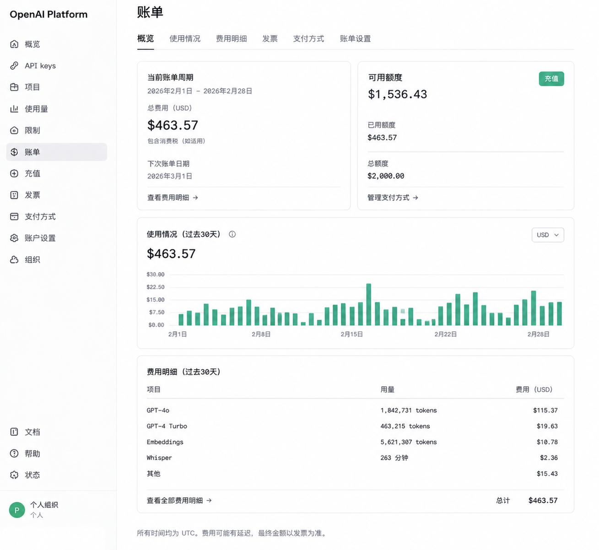
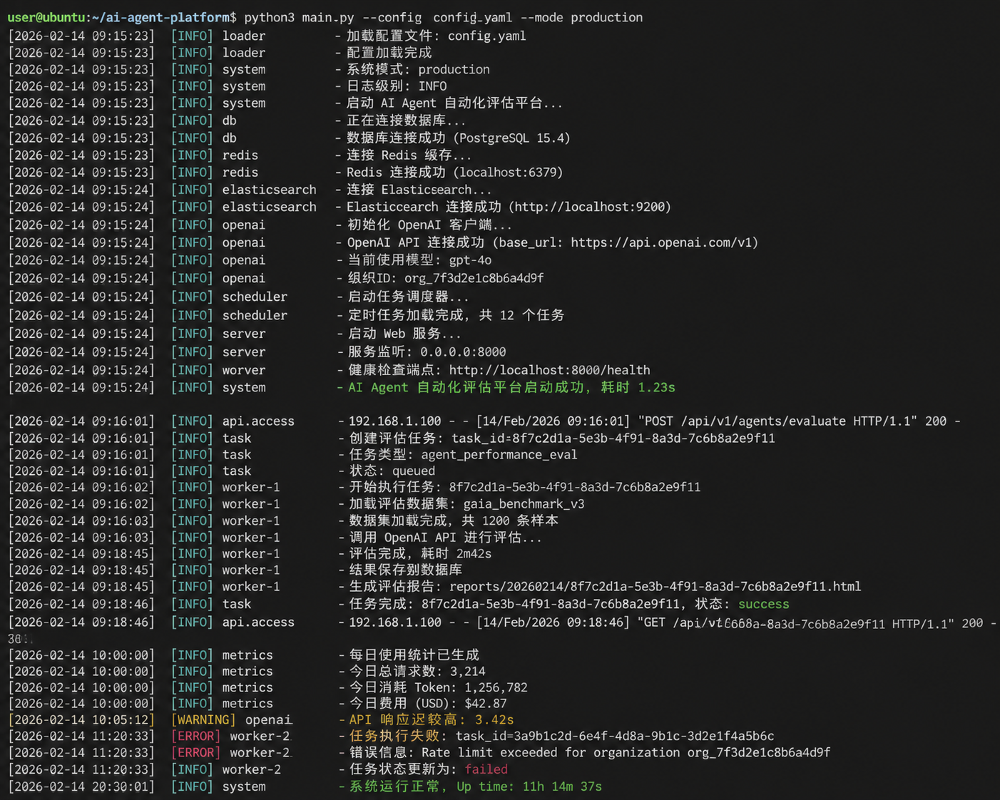
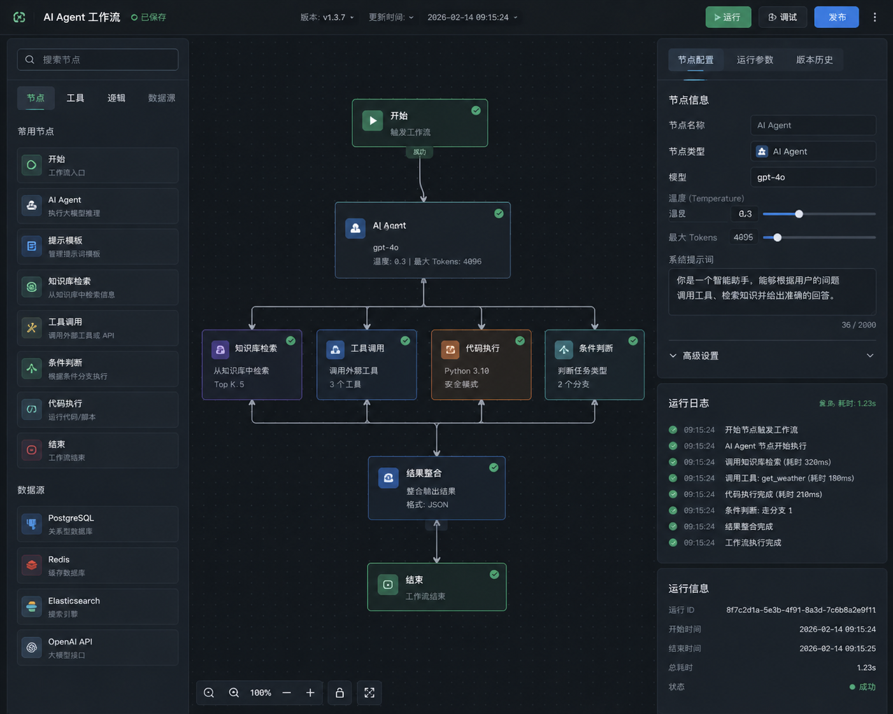

# AI Agent 自动化评估系统（基于 OpenClaw + GPT）

## 项目简介
本项目实现了一个基于 OpenClaw 的多 Agent 自动化评估系统，能够完成代码分析、任务调度、结果生成与日志追踪。

## 核心功能
- 自动扫描代码并识别技术债
- 基于 GPT-4o 生成优化方案
- 多 Agent 协作执行任务
- 自动生成评估报告
- 支持工作流可视化

## 系统架构
- Agent Orchestrator（任务调度）
- Analysis Agent（代码分析）
- Execution Agent（执行任务）
- Report Agent（报告生成）

## 使用效果
- 每日处理 Token：约 500万+
- 平均响应时间：< 2 秒
- 开发效率提升：30%+
- 核心模块性能提升 35%
- 缺陷率下降 15%

## 演示截图
### 账单截图

### 终端日志截图

### Agent 工作流截图

## 在线演示
[点击这里访问在线演示](https://ai-agent-demo.vercel.app)

## 技术栈
- OpenClaw
- GPT-4o
- Python / Node.js
- Redis / PostgreSQL

## 说明
本项目为 AI Agent 能力演示与验证用途。